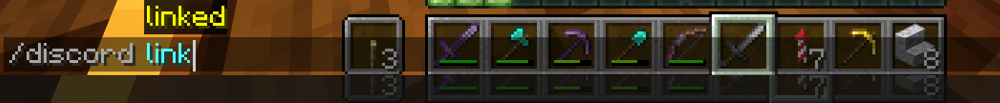
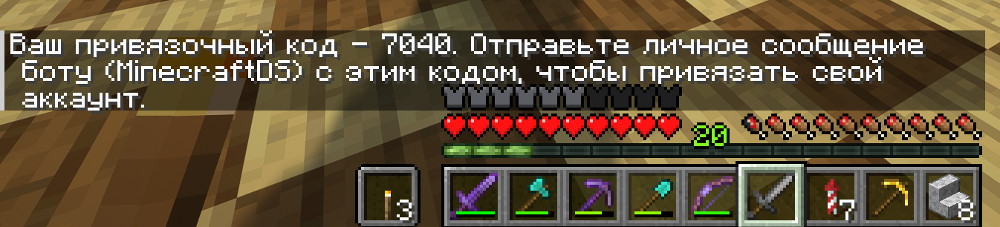
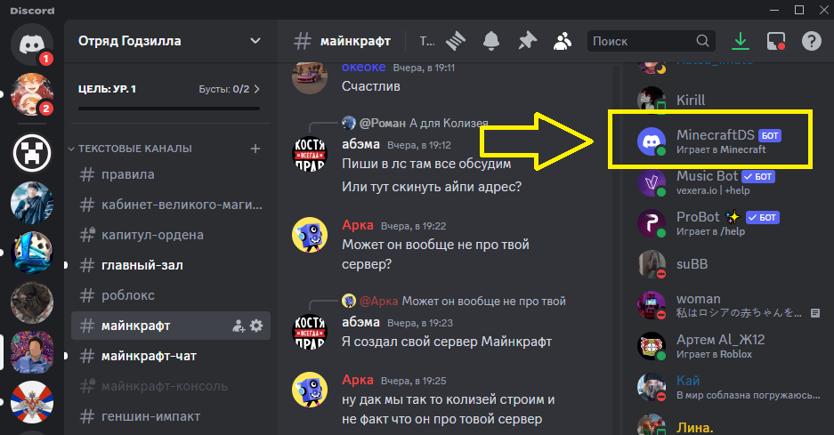
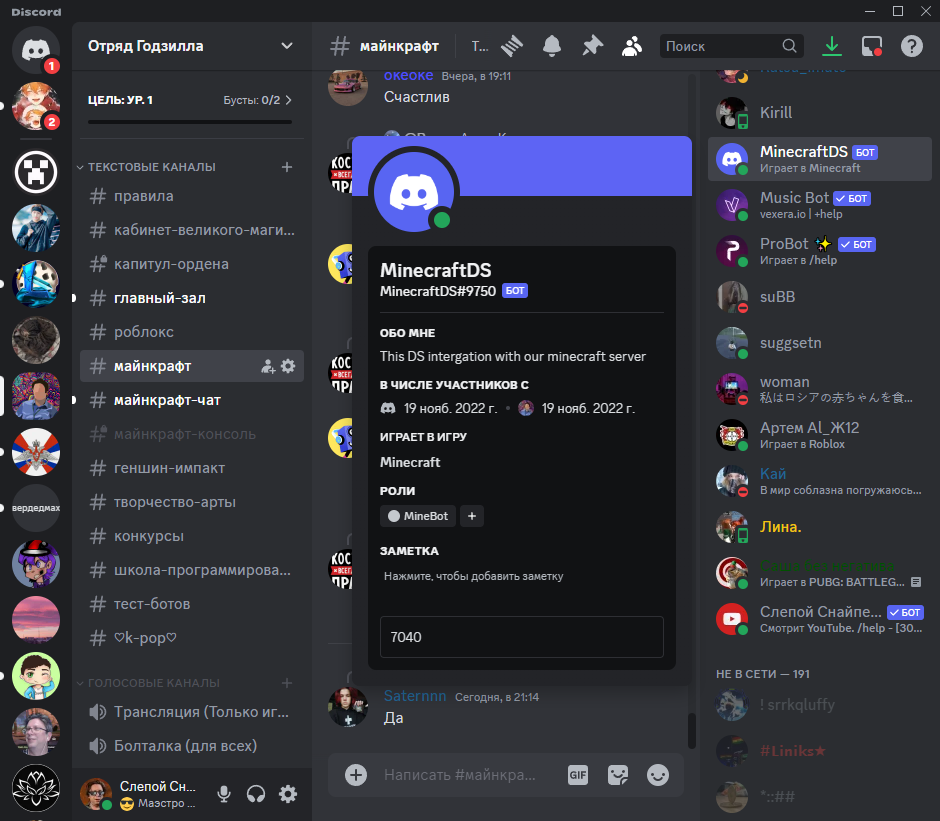
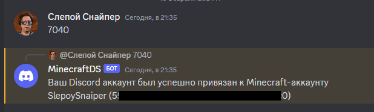

## Как привязать свой дискорд к аккаунту в Майнкрафте

Вводим команду **/discord link**

Получаем код:

Находим бота MinecraftDS в нашей группе в DS.

Отправляем код ему!

Если все хорошо, бот ответит что ваш аккаунт привязался.

