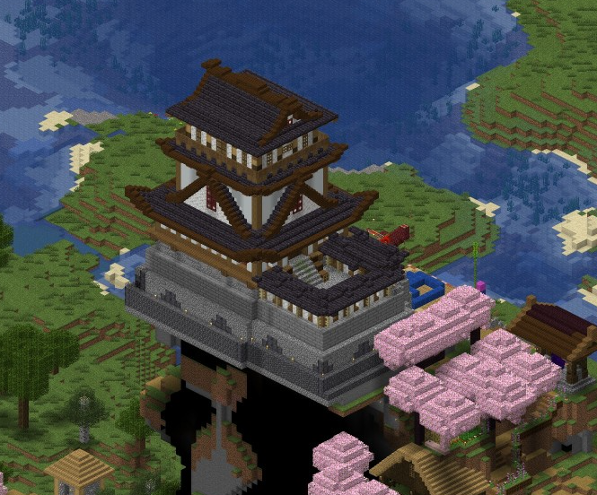

# Чудеса нашего мира

Чудеса света. В номинацию принимаются постройки, имеющие прототип в реальном мире, существующий сейчас или существовавший когда-то.

<table class="sortable" >
<tr>
	<th> № </th><th> Название </th><th>   Изображение </th><th> Описание </th><th> Кто построил </th>
</tr>
<tr>
	<td>1</td>
	<td> <a href="https://minecraft.zkir.ru/?worldname=world&mapname=surface&zoom=5&x=207&y=64&z=400">Статуя Свободы</a> </td>
    <td> </img> </td>
    <td style="padding: 10px">
		Самая знаменитая статуя в мире и символ Нью-Йорка.   Многие, в прочем, считают, что никакая это не "Свобода", а Непобедимое Солнце, Sol Invictus.
		<a href="https://ru.wikipedia.org/w/index.php?search=Статуя%20Свободы&title=Служебная%3AПоиск&ns0=1">(Подробнее)</a> </td>
    <td align="center"> 
		</img>  
		DustiVann </td>
</tr>
<tr>
	<td>2</td>
	<td> <a href="https://minecraft.zkir.ru/?worldname=world&mapname=surface&zoom=5&x=-334&y=64&z=-4" >Эйфелевая башня</a> </td>
	<td>  </img>  </td>
	<td style="padding: 10px">
    	Как можно построить параболичекскую форму из прямых балок? Как бы там ни было, это место романтических свиданий и отличный вид на Старый Город.
       	Поэт сказал, что смотровая площадка на вершине Эйфелевой Башни - это единственное место на сервере, откуда ее не видно.
		<a href="https://ru.wikipedia.org/wiki/%D0%AD%D0%B9%D1%84%D0%B5%D0%BB%D0%B5%D0%B2%D0%B0_%D0%B1%D0%B0%D1%88%D0%BD%D1%8F" >(Подробнее)</a></td>
	<td align="center"> KaliopaMili </td>
</tr>
<tr>
	<td> 3 </td><td> <a href="https://minecraft.zkir.ru/?worldname=world&mapname=surface&zoom=5&x=-190&y=64&z=-83" >Биг Бен</a> </td>
	<td> </img> </td>
	<td style="padding: 10px">
		Биг-Бен -- это часы на здании парламента. Парламента у нас как не было, так и нет, так что это символ неудавшейся попытки внедрить республиканскую форму правления.
		<a href="https://ru.wikipedia.org/wiki/Биг-Бен">(Подробнее)</a> </td>
	<td align="center">
		</img> 
		danya_84
	</td>
</tr>
<tr>
	<td> 4 </td><td> <a href="https://minecraft.zkir.ru/?worldname=world&mapname=surface&zoom=5&x=-431&y=64&z=495" >Нойшванштайн</a> </td>
	<td> </img></td>
	<td style="padding: 10px">
		Замок на Лебедином Камне -- дом безумного короля. Министры ругали короля за такую огромную стройку и бесцельно потраченные на нее ресурсы,
		включая алмазные блоки, но они быстро окупились потоком туристов.
		<a href="https://ru.wikipedia.org/wiki/%D0%9D%D0%BE%D0%B9%D1%88%D0%B2%D0%B0%D0%BD%D1%88%D1%82%D0%B0%D0%B9%D0%BD">(Подробнее)</a> </td>
	<td align="center"> 
		</img>  
		SlepoySnaiper 
	</td>
</tr>
<tr>
	<td> 5 </td><td> <a href="https://minecraft.zkir.ru/?worldname=world&mapname=surface&zoom=7&x=-795&y=64&z=277">Висячие сады Семирамиды</a> </td>
	<td></img> </td>
	<td style="padding: 10px">
    	Мидийская царевна Амитис, выданная замуж за царя Вавилона, очень тосковала по пышным лесам своей родины. 
		Видя горе своей жены, царь Вавилона приказал устроить сады на уступах пирамиды. В сухом климате Вавилона сады просто так не росли,
		и тысячи рабов денно и нощно таскали ведра с водой для полива всех этих растений. 
	<a href="https://ru.wikipedia.org/wiki/%D0%92%D0%B8%D1%81%D1%8F%D1%87%D0%B8%D0%B5_%D1%81%D0%B0%D0%B4%D1%8B_%D0%A1%D0%B5%D0%BC%D0%B8%D1%80%D0%B0%D0%BC%D0%B8%D0%B4%D1%8B">(Подробнее)</a> </td>
	<td align="center">
		</img>   KPEMKA 
	</td>
</tr>
<tr>
	<td>6</td><td> <a href="https://minecraft.zkir.ru/?worldname=world&mapname=surface&zoom=6&x=-902&y=64&z=339" >Колизей</a> </td>
	<td> </img></td>
	<td style="padding: 10px">
		Когда-то здесь гладиаторы стражались с друг другом, дикими зверями и с зомби, которых не жалко. Говорят, однажды для развлечения горожан посреди арены
		было устроено искусственное озеро, чтобы показать морское сражение из нескольких галер. Теперь эта великая руина стоит практически без всякого использования. 		
		<a href="https://ru.wikipedia.org/w/index.php?go=Перейти&search=колизей&title=Служебная%3AПоиск&ns0=1">(Подробнее)</a> </td>
	<td align="center">
		</img>  Arka
	</td>
</tr>
<tr>
	<td> 7 </td><td> <a href="https://minecraft.zkir.ru/?worldname=world&mapname=surface&zoom=4&x=-3692&y=64&z=-1056" >Уголок самурая</a> </td>
	<td> </img> </td>
	<td style="padding: 10px">
		Замок Адзути построил сам Ода Набунага на холме высотой 110 м около озера Бива; он находился от столицы на расстоянии 14 ри (сколько бы это ни было).
	     Говорят, в японских замках водятся японские приведения -- бакемоно.
	<a href="https://ru.wikipedia.org/wiki/%D0%97%D0%B0%D0%BC%D0%BE%D0%BA_%D0%90%D0%B4%D0%B7%D1%83%D1%82%D0%B8" >(Подробнее)</a> </td>
	<td align="center">
		</img>  
		Hamato_Niji </td>
</tr>	
</table>

